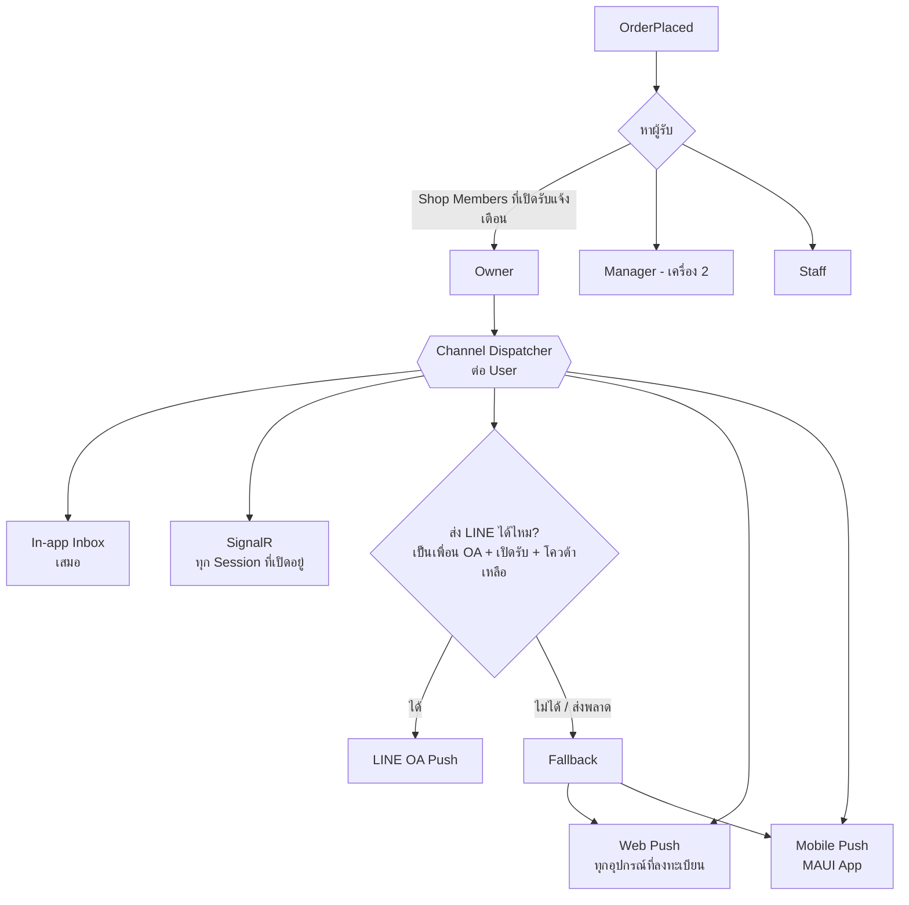

# 01 — Features & Roles

สัญลักษณ์ Phase: **P1** = MVP, **P2** = หลัง MVP, **P3** = ไว้ทีหลัง (ดู [Roadmap](05-roadmap.md))

> สถานะปัจจุบัน: ทำครบทุก Phase แล้ว ยกเว้นบางรายการที่ระบุไว้ใน [Roadmap](05-roadmap.md)

ข้อความ 💡 คือ Feature ที่เสนอเพิ่มจากโจทย์เดิมตาม Best Practice

---

## 1. แนวคิดหลัก: Plant (หมู่บ้าน) = Tenant

- ผู้ใช้ 1 คนอยู่ได้ **หลาย Plant** และสลับ Plant ได้จาก Header (คล้ายการเปลี่ยนที่อยู่จัดส่งใน Grab)
- ข้อมูลร้าน, สินค้า, Order ผูกกับ Plant เสมอ **คนนอก Plant มองไม่เห็นอะไรเลย** (ไม่มี Public Shop Page) ต้อง Login และเป็นสมาชิกที่ **Admin อนุมัติแล้ว (Active)** เท่านั้นจึงจะดูร้านและสั่งซื้อได้
- Role ผูกกับ **Membership ใน Plant** ไม่ได้ผูกกับ User ตรง ๆ เช่น นาย A อาจเป็น Admin ของหมู่บ้าน X แต่เป็นแค่ลูกค้าในหมู่บ้าน Y

## 2. Roles & Permissions

| Role | Scope | สิทธิ์หลัก |
|---|---|---|
| **System Admin** | ทั้งระบบ | สร้าง Plant, แต่งตั้ง Plant Admin คนแรก, ดู Health ระบบ |
| **Plant Admin** | ต่อ Plant | อนุมัติสมาชิก, Review คำขอเปิดร้าน, ระงับร้าน/สมาชิก, จัดการหมวดหมู่, ประกาศ, ดูรายงาน |
| **Shop Owner** | ต่อ Shop (1 คน) | ผู้รับผิดชอบร้านต่อ Admin ทำได้ทุกอย่าง รวมถึงจัดการสมาชิกร้านและโอนความเป็นเจ้าของ |
| **Shop Manager** | ต่อ Shop (หลายคน) | ทำได้เหมือน Owner ยกเว้นโอนร้าน/ลบ Owner เหมาะกับ **โทรศัพท์เครื่องที่ 2 ของเจ้าของ** หรือคู่สมรส |
| 💡 **Shop Staff** | ต่อ Shop (หลายคน) | จัดการ Order และ Stock ได้ แต่แก้ข้อมูลร้าน / Payment / สมาชิกร้านไม่ได้ (เช่น ลูก ๆ ช่วยแม่ดูร้าน) |
| **Member (ลูกค้า)** | ต่อ Plant | ดูร้าน, สั่งซื้อ, ขอเปิดร้าน, รีวิว |

> Owner / Manager / Staff เรียกรวมว่า **Shop Members** ไม่ใช่ Role ระดับ Plant แต่เกิดจากการเป็นสมาชิกของ Shop (Resource-based authorization) ทำให้ 1 คนอยู่ได้หลายร้าน และ 1 ร้านมีได้หลายคน

### Permission Matrix (ย่อ)

| Action | Member | Staff | Manager | Owner | Plant Admin |
|---|:-:|:-:|:-:|:-:|:-:|
| ดูร้าน / สั่งซื้อ | ✅ | ✅ | ✅ | ✅ | ✅ |
| ส่งคำขอเปิดร้าน | ✅ | ✅ | ✅ | ✅ | ✅ |
| รับแจ้งเตือน Order ใหม่ของร้าน | | ✅ | ✅ | ✅ | |
| รับ/ปฏิเสธ/อัปเดต Order ของร้าน | | ✅ | ✅ | ✅ | |
| แก้ Stock / Sold-out | | ✅ | ✅ | ✅ | |
| เปิด/ปิดร้าน, Busy Mode | | ✅ | ✅ | ✅ | |
| แก้ข้อมูลร้าน / เวลาเปิดปิด / Payment / Delivery Option | | | ✅ | ✅ | |
| เพิ่ม/ลบ Manager, Staff | | | ✅ | ✅ | |
| โอนความเป็นเจ้าของร้าน | | | | ✅ | |
| อนุมัติร้าน / ระงับร้าน | | | | | ✅ |
| อนุมัติสมาชิกเข้าหมู่บ้าน | | | | | ✅ |

---

## 3. Authentication (LINE Only)

- **P1** LINE Login (OAuth 2.0 / OIDC) บน Web, **LINE LIFF** เมื่อเปิดจากในแอป LINE (กดลิงก์จาก OpenChat แล้ว Login อัตโนมัติ ไม่ต้องกดอะไรเพิ่ม)
- **P1** Backend ตรวจ `id_token` กับ LINE แล้วออก **JWT ของระบบเอง** (Access 15 นาที + Refresh Token แบบ Rotation) เพื่อไม่ผูกระบบกับ LINE และเพิ่ม Provider อื่นภายหลังได้
- **P1** 💡 ตอน Login ใช้ `bot_prompt=aggressive` เพื่อชวนเพิ่มเพื่อน LINE Official Account ของระบบ → ใช้ส่ง Push แจ้งเตือนได้
- **P2** Mobile (MAUI) ใช้ OAuth + PKCE ผ่าน `WebAuthenticator` (LINE ไม่มี SDK ทางการสำหรับ .NET)

> ⚠️ LINE Login Channel และ Messaging API Channel ต้องอยู่ภายใต้ **Provider เดียวกัน** เพื่อให้ `userId` ตรงกัน ไม่งั้นจะ Push หา User ไม่ได้
>
> ⚠️ **LINE Notify ปิดให้บริการไปแล้ว (31 มี.ค. 2025)** ต้องใช้ Messaging API (LINE OA) แทน ซึ่งมีโควต้าข้อความต่อเดือนตามแพ็กเกจ

## 4. Plant & Membership

- **P1** สร้าง Plant (System Admin): ชื่อ, รูป, Time Zone (default `Asia/Bangkok`)
- **P1** **การเข้า Plant ต้องได้รับอนุมัติจาก Plant Admin เสมอ** (ไม่มีการเข้าอัตโนมัติ)
  1. ผู้ใช้กด **ลิงก์ / QR ขอเข้าหมู่บ้าน** (Admin แชร์ไว้ใน OpenChat ลิงก์นี้ใช้บอกแค่ว่าจะขอเข้า Plant ไหน **ไม่ได้ให้สิทธิ์เข้า**) หรือค้นหาด้วย Plant Code
  2. กรอกบ้านเลขที่ / ซอย / ชื่อเล่น (+ ข้อความถึง Admin) เพื่อยืนยันว่าเป็นคนในหมู่บ้าน
  3. Plant Admin ทุกคนได้รับแจ้งเตือน → `อนุมัติ` / `ปฏิเสธ (ระบุเหตุผล)`
  4. ระหว่างรออนุมัติ ผู้ใช้เห็นแค่หน้า "รอการอนุมัติ" ไม่เห็นร้านใด ๆ
- **P1** ลิงก์ขอเข้าหมู่บ้าน Reset ได้ (กันลิงก์หลุดไปนอกกลุ่มแล้วมีคนขอเข้ามาเยอะ)
- **P1** สถานะสมาชิก: `Pending → Active → Suspended / Left` (หรือ `Pending → Rejected`)
- **P1** Admin ระงับสมาชิก (เช่น ย้ายออกจากหมู่บ้าน) → เข้าดูร้านไม่ได้ทันที, ถ้าเป็น Shop Member ร้านที่ผูกอยู่ต้องให้ Admin จัดการต่อ
- **P1** แต่งตั้ง/ถอด Plant Admin ได้หลายคน
- **P2** 💡 ประกาศของหมู่บ้าน (Announcement / Banner) เช่น "พรุ่งนี้น้ำไม่ไหล", "ตลาดนัดวันเสาร์"
- **P2** 💡 หมวดหมู่ร้านระดับ Plant (อาหาร, ขนม, เครื่องดื่ม, ของใช้, บริการ, ซักรีด ฯลฯ) ให้ Admin กำหนดเองได้

## 5. Shop Application (ขอเปิดร้าน)

- **P1** Member กรอกฟอร์ม: ชื่อร้าน, หมวดหมู่, รายละเอียด, บ้านเลขที่, รูปตัวอย่างสินค้า, เบอร์ติดต่อ
- **P1** Admin Review: `Approve` / `Reject (ระบุเหตุผล)` / 💡 `Request Changes` (ขอข้อมูลเพิ่ม แล้วผู้ขอแก้ไขส่งใหม่ได้)
- **P1** แจ้งผลผู้ขอผ่าน LINE + In-app
- **P1** 💡 ร้านที่อนุมัติแล้ว Admin ระงับ (`Suspended`) ได้ เช่น มีรายงานปัญหา

```
Draft → Submitted → (ChangesRequested ⇄ Submitted) → Approved → Shop ถูกสร้าง
                                                    ↘ Rejected
```

## 6. Shop Management

### ข้อมูลร้าน (P1)
- ชื่อ, Logo, รูป Cover, คำอธิบาย, หมวดหมู่, บ้านเลขที่/ตำแหน่งในหมู่บ้าน, เบอร์โทร, ลิงก์ LINE ส่วนตัว (optional)

### เวลาเปิด-ปิด (P1)
- **ตารางประจำสัปดาห์** หลายช่วงต่อวันได้ เช่น จ-ศ 06:00–09:00 และ 16:00–19:00
- **วันหยุดพิเศษ / ปิดเป็นช่วง** (Closure Period) เช่น ปิด 10–15 ต.ค. ไปต่างจังหวัด
- **Manual Override** (ปุ่มใหญ่ในหน้า Merchant แบบ GrabMerchant):
  - "เปิดร้านตอนนี้" (แม้นอกเวลา) จนถึงเวลา X หรือจนกว่าจะปิดเอง
  - "ปิดร้านตอนนี้" จนถึงเวลา X / จนถึงรอบเปิดถัดไป / จนกว่าจะเปิดเอง
- 💡 **Busy Mode / หยุดรับ Order ชั่วคราว**: ร้านยังเปิด แต่ไม่รับ Order ใหม่ 15/30/60 นาที (ของเยอะทำไม่ทัน)
- 💡 **Vacation Mode**: ซ่อนร้านจากหน้าแรกพร้อมข้อความ "กลับมา 16 ต.ค."

**ลำดับการคำนวณสถานะร้าน (Effective Status):**
```
Suspended (Admin) > Vacation/Closure Period > Manual Override > Weekly Schedule
แล้วซ้อนด้วย Busy Mode (เปิดอยู่ แต่ไม่รับ Order ใหม่)
```
สถานะที่แสดงให้ลูกค้าเห็น: `เปิดอยู่` · `กำลังจะปิดใน 30 นาที` · `ยุ่งอยู่ ไม่รับ Order ชั่วคราว` · `ปิด · เปิดอีกครั้ง 16:00` · `ปิดชั่วคราวถึง 16 ต.ค.`

### การตั้งค่า Order (P1)
- 💡 **Accept Mode**: `Manual` (ร้านกดรับเอง) / `Auto Accept`
- 💡 **Order Timeout**: ถ้าร้านไม่กดรับภายใน N นาที → Order หมดอายุอัตโนมัติ + แจ้งลูกค้า
- 💡 **รับ Pre-order ตอนร้านปิดหรือไม่** (สั่งล่วงหน้าแล้วรับรอบถัดไป)
- 💡 **เวลาเตรียมโดยประมาณ** (Prep Time) ไว้แสดง ETA

### Delivery Options (P1)
ภายในหมู่บ้าน **ไม่มีค่าส่ง** และ **ไม่มี Rider** มีแค่ 2 วิธี ร้านเลือกเปิดได้เอง (ต้องเปิดอย่างน้อย 1 วิธี)

| Option | ความหมาย (สินค้า) | ความหมาย (บริการ) | ร้านตั้งค่าได้ |
|---|---|---|---|
| `Pickup` | ลูกค้ามารับเองที่ร้าน | ลูกค้ามารับบริการที่ร้าน | จุดรับ/คำแนะนำ เช่น "กดกริ่งหน้าบ้านเลขที่ 12/3" |
| `Delivery` | ร้านไปส่งเองถึงบ้าน | ร้านไปให้บริการที่บ้านลูกค้า | 💡 โซนที่ส่ง (optional เช่น "เฉพาะซอย 1–5"), 💡 ยอดขั้นต่ำสำหรับส่ง (optional) |

- ลูกค้าเห็นเฉพาะ Option ที่ร้านเปิด ถ้าร้านเปิดอย่างเดียวจะเลือกให้อัตโนมัติ
- **ไม่มีการคำนวณค่าส่งในระบบ** ยอด Order = ราคาสินค้ารวมเท่านั้น
- **P2** 💡 กำหนด Option ระดับสินค้าได้ เช่น น้ำแข็งถุงใหญ่ "รับที่ร้านเท่านั้น"

### Payment Methods (P1)
ร้านเปิด/ปิดแต่ละวิธีได้เอง และเรียงลำดับได้

| Type | ข้อมูลที่ร้านกำหนด | หมายเหตุ |
|---|---|---|
| `Cash` | – | เงินสดตอนรับของ |
| `PromptPayQr` | 💡 PromptPay ID (เบอร์/เลขบัตร) **หรือ** อัปโหลดรูป QR เอง | 💡 ถ้าใส่ PromptPay ID ระบบ **Generate QR พร้อมยอดเงินของ Order** ให้อัตโนมัติ (มาตรฐาน EMVCo) ลูกค้าไม่ต้องพิมพ์ยอดเอง |
| `BankTransfer` | ธนาคาร, เลขบัญชี, ชื่อบัญชี | มีปุ่ม Copy เลขบัญชี |
| `Custom` | ชื่อ (เช่น "เป๋าตัง / ไทยช่วยไทย"), คำแนะนำ, รูป (optional), ต้องแนบหลักฐานหรือไม่ | ยืดหยุ่นสำหรับวิธีอื่น ๆ |

### Shop Members (P1)
ร้าน 1 ร้านมีผู้ใช้ได้หลายคน เช่น เจ้าของมีโทรศัพท์ 2 เครื่อง, สามีภรรยาช่วยกันขาย, ลูกช่วยดูร้าน
- Owner / Manager เชิญสมาชิกที่ **Active ใน Plant เดียวกัน** ผ่าน QR / ลิงก์เชิญร้าน (หมดอายุใน 24 ชม.) → ผู้ถูกเชิญกดยอมรับ
- กำหนด Role: `Manager` / `Staff` (ดู [Permission Matrix](#permission-matrix-ย่อ))
- 💡 สมาชิกร้านแต่ละคนเปิด/ปิด **"รับแจ้งเตือน Order ใหม่"** ของตัวเองได้ (เช่น Staff ปิดตอนไม่ได้อยู่ร้าน) แต่ระบบบังคับให้มีอย่างน้อย 1 คนเปิดไว้
- 💡 Timeline ของ Order แสดงชื่อผู้กด เช่น "รับ Order โดย แม่ (เครื่อง 2)"
- Owner โอนความเป็นเจ้าของให้ Manager ได้, ออกจากร้านเองได้ (ยกเว้น Owner)

> ℹ️ บัญชี LINE หนึ่งบัญชีใช้บนสมาร์ตโฟนได้ทีละเครื่อง โทรศัพท์เครื่องที่ 2 จึงมักเป็น LINE อีกบัญชี = User อีกคน → เพิ่มเป็น `Manager` ของร้าน ถ้าเป็นบัญชีเดียวกันบนหลายอุปกรณ์ (เช่น มือถือ + iPad) ระบบส่งแจ้งเตือนได้ทุกอุปกรณ์อยู่แล้ว (ดู [Notifications](#9-notifications))

## 7. Catalog & Stock

### ประเภทรายการ (Item Type)

| Type | ตัวอย่าง | Stock |
|---|---|---|
| `Product` + `Tracked` | น้ำพริก 20 กระปุก | นับจำนวนคงเหลือ |
| `Product` + `Untracked` | น้ำแข็ง, ข้าวผัด (ทำตามสั่ง) | ไม่นับ มีแค่ปุ่ม Sold-out |
| 💡 `Product` + `DailyStock` | ข้าวมันไก่วันละ 30 จาน | Reset จำนวนอัตโนมัติทุกวัน ณ เวลาที่กำหนด |
| `Service` + `Untracked` | ซ่อมแอร์ (นัดคุยกันเอง) | ไม่มี |
| 💡 `Service` + `Slot` (P2) | นวด 60 นาที | จองเป็นช่วงเวลา มี Capacity ต่อ Slot (เช่น หมอนวด 2 คน = 2 คิว/ช่วง) |
| 💡 `PreOrderRound` (P2) | ขนมจีบ: สั่งได้ถึงศุกร์ 20:00 รับเสาร์ 08:00–10:00 | มีโควต้าต่อรอบ (optional) |

### ความสามารถของสินค้า/บริการ
- **P1** ชื่อ, รายละเอียด, ราคา, รูป (หลายรูป), หมวดหมู่ภายในร้าน (เมนูแนะนำ, ของทอด, เครื่องดื่ม), เรียงลำดับ
- **P1** เปิด/ปิดการขาย, Sold-out ด้วยปุ่มเดียว (แบบ GrabMerchant)
- **P1** **ช่วงเวลาจำหน่าย** (Availability Window) เช่น โจ๊กขายแค่ 06:00–09:00, หรือขายเฉพาะวันเสาร์-อาทิตย์
- **P1** **ช่วงวันที่จำหน่าย** (Sale Period) เช่น ขนมไหว้พระจันทร์ 1–30 ก.ย.
- **P2** 💡 **Options / Add-ons** (Modifier Group): เลือกขนาด (บังคับเลือก 1), เพิ่มไข่ +10, ระดับความเผ็ด, จำนวนสูงสุดที่เลือกได้ เหมือน Grab ทุกอย่าง
- **P2** 💡 จำกัดจำนวนต่อ Order (Max per order)
- **P1** 💡 **Low-stock Alert** แจ้งร้านเมื่อเหลือต่ำกว่า X
- **P1** 💡 **Stock Movement Ledger**: ทุกการเปลี่ยนแปลง Stock มีประวัติ (เติมของ, ขาย, ยกเลิก, ปรับยอด) ตรวจสอบย้อนหลังได้
- **P1** 💡 แสดง "เหลือ 3 ชิ้น" ให้ลูกค้าเมื่อใกล้หมด (กระตุ้นการซื้อ)

### Stock Logic (สำคัญ)
ตามโจทย์ "ตัด Stock เมื่อ Order สำเร็จ" แต่ถ้าตัดตอนสำเร็จอย่างเดียวจะเกิด **Overselling** (ของเหลือ 1 แต่มี 3 คนสั่ง) จึงเสนอแบบ **Reserve → Commit / Release**

| เหตุการณ์ | OnHand | Reserved | Available (= OnHand − Reserved) |
|---|---|---|---|
| เริ่มต้น | 10 | 0 | 10 |
| ลูกค้าสั่ง 2 (`OrderPlaced`) → **Reserve** | 10 | 2 | 8 |
| Order สำเร็จ (`OrderCompleted`) → **Commit** (ตัดจริง) | 8 | 0 | 8 |
| หรือ ยกเลิก/ปฏิเสธ/หมดอายุ → **Release** | 10 | 0 | 10 |

เมื่อ Available = 0 → แสดง Sold-out อัตโนมัติ (รายละเอียดใน [Domain Model](04-domain-model.md#stock-reservation))

## 8. Cart & Order

### Cart
- **P1** 1 Cart = 1 ร้าน (แบบ Grab: ถ้าเพิ่มของร้านอื่น ถามว่าจะล้างตะกร้าเดิมไหม)
- **P1** Cart เก็บฝั่ง Server (ข้ามอุปกรณ์ได้, ร้านเปลี่ยนราคา/หมด ระบบเตือนก่อน Checkout)

### Checkout
- **P1** เลือกวิธีรับ: `รับเองที่ร้าน` / `ให้ร้านไปส่ง` (เฉพาะที่ร้านเปิดไว้, ไม่มีค่าส่ง)
- **P1** เลือกเวลารับ: **"เร็วที่สุด / รับได้ตลอด"** หรือ **เลือกช่วงเวลา** (Slot ที่ร้านเปิด เช่น ทุก 30 นาที)
- **P1** ที่อยู่ในหมู่บ้าน (บ้านเลขที่/ซอย) ใช้ค่า Default จาก Membership แก้ได้ (เฉพาะกรณีให้ร้านไปส่ง)
- **P1** เลือก Payment Method จากที่ร้านเปิดไว้
- **P1** หมายเหตุถึงร้าน (ไม่ใส่ผัก, วางไว้หน้าบ้าน)
- **P1** 💡 **Idempotency Key** ป้องกันกดสั่งซ้ำตอนเน็ตช้า

### Order Lifecycle

```
PendingAcceptance ──(ร้านรับ)──> Accepted ──> Preparing ──> Ready ─┬─(รับที่ร้าน)──────────────┐
      │  │                                                        └─> OutForDelivery ─> Delivered
      │  └─(timeout)─> Expired                                                               │
      ├─(ร้านปฏิเสธ)─> Rejected                                                               ▼
      └─(ลูกค้ายกเลิก)─> Cancelled                                    Completed <─(ลูกค้ายืนยันรับ / Auto)
```

- **P1** **ผู้ขายยืนยันส่ง** (`Delivered`) + **แนบรูปการส่ง (Optional)** เช่น รูปของที่วางหน้าบ้าน
- **P1** **ผู้ซื้อยืนยันรับ** → `Completed` → ตัด Stock (Commit)
- **P1** 💡 **Auto-complete**: ถ้าผู้ซื้อไม่กดยืนยันภายใน X ชั่วโมงหลังร้านส่ง ระบบปิด Order ให้อัตโนมัติ (ไม่งั้น Order ค้างตลอดไป)
- **P1** 💡 ลูกค้ายกเลิกได้เฉพาะก่อนร้านรับ, หลังจากนั้นต้อง "ขอยกเลิก" ให้ร้านอนุมัติ
- **P1** 💡 เลข Order สั้น อ่านง่าย เช่น `#A-023` (Prefix ร้าน + Running รายวัน) ไว้เรียกตอนรับของ
- **P1** 💡 **Snapshot** ชื่อ/ราคาสินค้าใน Order ณ ตอนสั่ง (ร้านแก้ราคาทีหลัง Order เดิมไม่เปลี่ยน)
- **P1** Timeline ของ Order ว่าใครทำอะไรเมื่อไร (Audit)

### Payment Status (แยกจาก Order Status)

```
Unpaid ──(ลูกค้าแนบสลิป)──> PendingVerification ──(ร้านยืนยัน)──> Paid
                                    └──(ร้านปฏิเสธ + เหตุผล)──> Rejected ──(แนบใหม่)──> PendingVerification
Cash: Unpaid ──(ร้านกด "ได้รับเงินแล้ว" ตอนส่ง)──> Paid
```

- **P1** ลูกค้าแนบสลิป/ไฟล์ได้หลายไฟล์ (รูป/PDF), ไฟล์เป็น Private (เห็นเฉพาะผู้ซื้อ, ร้าน, Plant Admin)
- **P2** 💡 อ่าน QR บนสลิป (Mini-QR ที่ธนาคารใส่มา) เพื่อ **ตรวจสลิปซ้ำ** (กันใช้สลิปเดิมกับหลาย Order)
- **P3** 💡 ต่อ Slip Verification API (มีค่าใช้จ่าย ทำเป็น Plugin optional)
- **P2** 💡 ร้านตั้งได้ว่า "ต้องชำระก่อนร้านเริ่มทำ" หรือ "จ่ายตอนรับของ"

## 9. Notifications

### 9.1 แนวคิด: แจ้ง "User" ไม่ใช่แจ้ง "ร้าน"
Event ของร้าน (เช่น Order ใหม่) จะถูก **กระจาย (Fan-out) ไปยัง Shop Members ทุกคน** ที่เปิดรับแจ้งเตือนไว้ แล้วแต่ละ User ได้รับผ่าน **ทุกช่องทาง/ทุกอุปกรณ์** ที่ใช้ได้ ถ้าส่ง LINE ไม่ได้ก็ยังมีช่องทางอื่นรองรับ



### 9.2 Channels

| Channel | ทำงานเมื่อ | หลายอุปกรณ์ | Phase |
|---|---|---|---|
| **In-app Inbox + Badge** | เสมอ (Source of truth ของการแจ้งเตือน) | ✅ | P1 |
| **Real-time (SignalR)** | User เปิดแอปอยู่ → เสียงเตือนวนซ้ำ + Pop-up (แบบ Merchant App) | ✅ ทุก Session | P1 |
| **LINE OA Push** | User **เป็นเพื่อนกับ LINE OA** และไม่ได้ Block (รู้จาก Webhook `follow`/`unfollow`) | ตามแอป LINE | P1 |
| **Web Push (PWA, VAPID)** | User ติดตั้ง PWA แล้วกดอนุญาต | ✅ ต่ออุปกรณ์ | P1 (ช่องทางสำรองหลักของ LINE) |
| **Mobile Push (FCM/APNs)** | ติดตั้งแอป MAUI | ✅ ต่ออุปกรณ์ | P2 |

**กติกาการเลือกช่องทาง (ต่อ User ต่อ Event)**
1. บันทึก In-app ทุกครั้ง + ส่ง SignalR ไปทุก Session ที่ออนไลน์
2. ส่ง LINE ถ้า: เป็นเพื่อน OA และ User เปิดรับ Event นี้ทาง LINE และโควต้ารายเดือนยังเหลือ (ตาม Priority ด้านล่าง)
3. ส่ง Web Push / FCM ไป **ทุกอุปกรณ์** ที่ลงทะเบียนไว้ (ส่งซ้อนกับ LINE ได้ ผู้ใช้เลือกได้ว่า "ส่งเฉพาะเมื่อ LINE ส่งไม่ได้")
4. ถ้า LINE ส่งไม่สำเร็จ (ไม่ใช่เพื่อน, ถูก Block, หมดโควต้า, API Error) → บังคับส่ง Web Push / FCM
5. ถ้า User ไม่มีช่องทาง Push ใดเลย → เหลือแค่ In-app และขึ้นเตือนในหน้าตั้งค่า

### 9.3 Order ใหม่ถึงร้าน: กันพลาด
- 💡 **Reminder / Escalation**: ถ้ายังไม่มีใครกดรับใน 3 นาที (ตั้งค่าได้) ส่งเตือนซ้ำไปยัง Shop Members ทุกคน ก่อนถึง Order Timeout
- 💡 **ใครรับก่อนได้ก่อน**: พอสมาชิกคนหนึ่งกดรับ เสียงเตือนบนเครื่องอื่นหยุดทันที (SignalR) และแสดง "รับโดย X" ถ้ากดพร้อมกันระบบใช้ Optimistic Concurrency คนที่สองเห็น "Order นี้ถูกรับแล้ว"
- 💡 **Notification Health Check** ในหน้าตั้งค่าร้าน แสดงสถานะของสมาชิกแต่ละคน เช่น
  `แม่ ✅ LINE ✅ Web Push` · `แม่ (เครื่อง 2) ⚠️ ยังไม่ได้เพิ่มเพื่อน LINE OA [เพิ่มเพื่อน] [เปิด Web Push]`
  และ **ไม่ให้เปิดร้านรับ Order** ถ้าทั้งร้านไม่มีสมาชิกคนไหนมีช่องทาง Push เลย (แค่เตือนหรือบังคับ ให้ Plant ตั้งค่าได้)
- 💡 ปุ่ม **"ทดสอบแจ้งเตือน"** ส่งข้อความทดสอบไปทุกช่องทางของตัวเอง

### 9.4 Notification Matrix

| Event | ผู้รับ | LINE Priority |
|---|---|---|
| Order ใหม่ / Reminder | Shop Members (ที่เปิดรับ) | 🔴 สูง |
| ลูกค้าแนบสลิป / ขอยกเลิก | Shop Members | 🔴 สูง |
| ร้านรับ / ปฏิเสธ / Order หมดอายุ | ลูกค้า | 🔴 สูง |
| ร้านส่งแล้ว (ขอให้ยืนยันรับ) | ลูกค้า | 🔴 สูง |
| กำลังเตรียม / พร้อมรับ | ลูกค้า | 🟡 กลาง |
| สลิปถูกปฏิเสธ | ลูกค้า | 🔴 สูง |
| คำขอเข้าหมู่บ้าน / คำขอเปิดร้าน | Plant Admins | 🟡 กลาง |
| ผลอนุมัติเข้าหมู่บ้าน / เปิดร้าน | ผู้ขอ | 🔴 สูง |
| Stock ใกล้หมด | Shop Members (Owner/Manager) | 🟢 ต่ำ (ไม่ส่ง LINE ค่าเริ่มต้น) |
| ร้านโปรดเปิดแล้ว (P2) | ลูกค้าที่กด Favorite | 🟢 ต่ำ (ไม่ส่ง LINE ค่าเริ่มต้น) |

- **LINE Quota Guard**: นับข้อความที่ส่งต่อเดือน (การส่งหาผู้รับ 3 คนนับเป็น 3 ข้อความ) เมื่อใกล้ถึงโควต้าจะส่ง LINE เฉพาะ 🔴 ที่เหลือใช้ Web Push / FCM แทน และแจ้ง System Admin
- 💡 ผู้ใช้ตั้งค่าได้ต่อประเภท Event × ช่องทาง และตั้ง **ช่วงห้ามรบกวน** ได้ (ยกเว้น Order ใหม่ของร้านตัวเอง)
- 💡 LINE Push ใช้ **Flex Message** ที่มีปุ่ม "ดู Order" เปิด LIFF ตรงไปที่ Order นั้น

> ⚠️ ข้อจำกัดของ Web Push: **iOS** ต้อง "เพิ่มไปที่หน้าจอโฮม" ก่อน (iOS 16.4+) และ **เบราว์เซอร์ในแอป LINE (LIFF) ไม่รองรับ Web Push** ช่วงเริ่มต้นจึงแนะนำให้เจ้าของร้าน **เพิ่มเพื่อน LINE OA** เป็นช่องทางหลัก และติดตั้ง PWA (หรือแอป MAUI ใน P2) เป็นช่องทางสำรอง

## 10. Feature เสริมที่แนะนำ 💡

| Feature | ทำไม | Phase |
|---|---|---|
| **Share to OpenChat** | ชุมชนยังอยู่ใน OpenChat (ไม่มี API ให้ Bot) จึงทำปุ่ม Share/Copy ลิงก์ร้าน/สินค้า/รอบ Pre-order ไปโพสต์ได้ทันที **Link Preview แสดงแค่ข้อความกลาง ๆ** (ชื่อแอป + "เปิดดูใน SmartShop") ไม่มีข้อมูลร้าน เพราะคนนอกหมู่บ้านห้ามเห็น กดแล้วต้อง Login และเป็นสมาชิก Active ของ Plant นั้นจึงจะเห็นเนื้อหา | P1 |
| **Favorite Shops + แจ้งเตือนเมื่อร้านเปิด** | "ร้านโจ๊กเปิดแล้ว!" แก้ปัญหาไม่รู้ว่าร้านเปิดไหมได้ตรงจุด | P2 |
| **Re-order** | สั่งซ้ำ Order เดิมได้ในคลิกเดียว | P2 |
| **Rating & Review** | ให้ดาว + ความเห็นหลัง Completed, ร้านตอบกลับได้ | P2 |
| **In-order Chat** | คุยกันใน Order (แทนแชทที่ตกหล่น) ข้อความผูกกับ Order | P2 |
| **Merchant Dashboard** | ยอดขายวันนี้/สัปดาห์, สินค้าขายดี, Export CSV | P2 |
| **Report / Dispute** | ลูกค้ารายงานปัญหา Order → Plant Admin | P2 |
| **ค้นหา** | ค้นหาร้าน + สินค้า ข้ามร้านในหมู่บ้าน (PostgreSQL Full-text / `pg_trgm` รองรับภาษาไทยแบบ trigram) | P1 |
| **Promotions / Coupons** | ลดราคา, ซื้อครบ X ลด Y | P3 |
| **Group Buy** | รวม Order ทั้งซอยเพื่อสั่งของจากนอกหมู่บ้าน | P3 |
| **Multi-language** | TH / EN | P2 |
| **PDPA** | Consent, ขอ Export/ลบข้อมูลตัวเอง, ซ่อนเบอร์โทรจนกว่าจะมี Order, ข้อมูลทั้งหมดเห็นเฉพาะสมาชิกใน Plant | P1 |
| **Audit Log** | ทุก Action ของ Admin/ร้าน ตรวจสอบย้อนหลังได้ | P1 |

## 11. ร้านค้า: เชื่อมต่อระบบอื่น (P3)

- **API key** ต่อร้าน (เฉพาะ Owner) สำหรับเครื่องพิมพ์ใบสั่ง, POS, Google Sheets: อ่าน Order และเมนู/สต็อก
- **Webhook** แจ้งเหตุการณ์ Order และการชำระเงินไปยัง URL ของร้าน พร้อมลายเซ็น HMAC และส่งซ้ำอัตโนมัติ
- รายละเอียดอยู่ใน [06 — Public API & Webhooks](06-public-api.md)

## 12. Admin หมู่บ้าน: Audit log (P1/P3)

บันทึกว่าใครอนุมัติ/ระงับสมาชิก, อนุมัติหรือปฏิเสธร้าน, ระงับร้าน, ประกาศ, ซ่อนรีวิว เมื่อไร ดูได้ที่ **Admin → เพิ่มเติม → บันทึกการดูแลระบบ**
