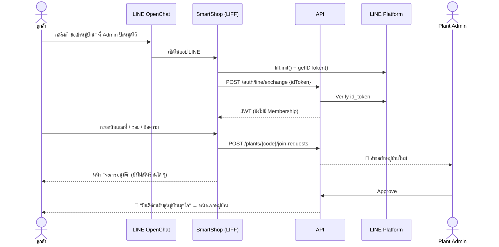
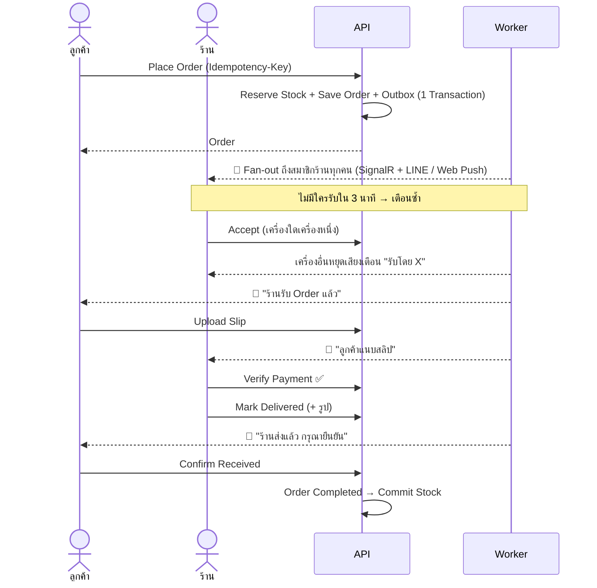
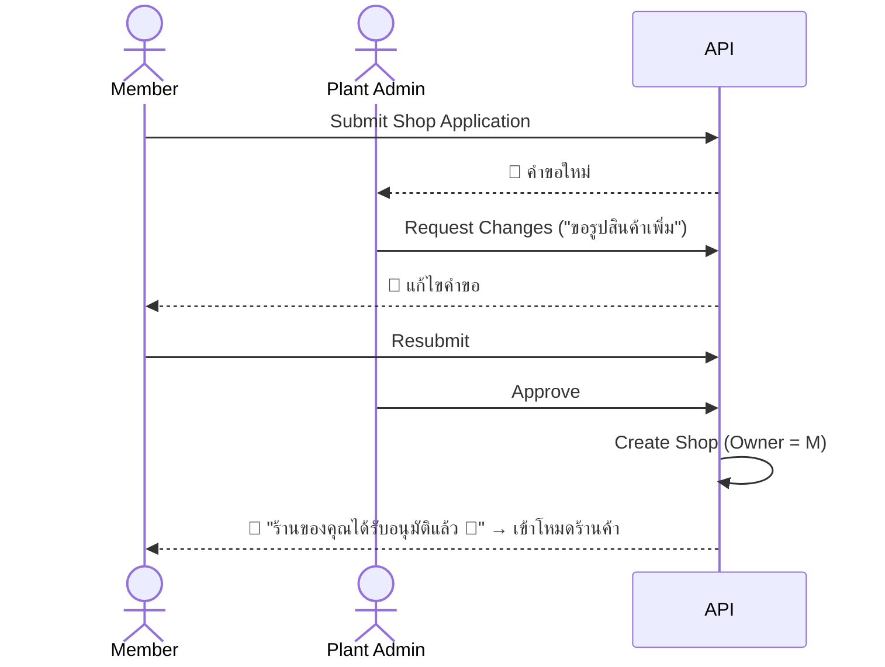

# 02 — UX / UI Flows

หลักการ: **ลอก Pattern ที่ผู้ใช้คุ้นเคยจาก Grab / LINE MAN** เพื่อลด Learning Curve ทั้งลูกค้าและเจ้าของร้าน (ส่วนมากเป็นผู้สูงอายุหรือแม่ค้าที่ใช้ GrabMerchant / LINE MAN Wongnai Merchant อยู่แล้ว)

- Mobile-first ทุกหน้า (ใช้งานใน LIFF / PWA / MAUI เป็นหลัก)
- 1 แอป 2 โหมด: **โหมดลูกค้า** และ **โหมดร้านค้า** (สลับจากเมนูโปรไฟล์ คล้ายสลับไป Merchant App) + **โหมด Admin** สำหรับ Plant Admin
- ตัวหนังสือใหญ่, ปุ่มใหญ่, สีสถานะชัด (เขียว = เปิด, เทา = ปิด, ส้ม = ยุ่ง)

---

## 1. โหมดลูกค้า (Customer)

### Bottom Navigation
`🏠 หน้าแรก` · `🧾 คำสั่งซื้อ` · `🔔 แจ้งเตือน` · `👤 โปรไฟล์`

### หน้าแรก (Home), อิง Grab Food Home
```
┌──────────────────────────────┐
│ 📍 หมู่บ้านสุขใจ ▾       🔔  │  ← Plant Switcher (เหมือนเลือกที่อยู่)
│ 🔍 ค้นหาร้าน หรือเมนู...      │
├──────────────────────────────┤
│ [ประกาศ: ตลาดนัดเสาร์นี้ 🎉]  │  ← Banner จาก Admin (P2)
│ 🍜อาหาร 🧁ขนม 🧋น้ำ 💆บริการ  │  ← Category Chips
│ ── เปิดอยู่ตอนนี้ ─────── ▸   │  ← Horizontal carousel
│ [รูป][รูป][รูป]               │
│ ── ร้านทั้งหมด ───────────    │
│ ┌────┐ ร้านป้าแดง ข้าวมันไก่  │
│ │ IMG│ 🟢 เปิด · ปิด 13:00    │
│ └────┘ ⭐4.8 · ซอย 5 · ~15 นาที│
│ ┌────┐ นวดแผนไทยพี่นิด        │
│ │ IMG│ ⚪ ปิด · เปิด พรุ่งนี้ 10:00 │
└──────────────────────────────┘
```
- เรียง: เปิดอยู่ก่อน → ใกล้จะเปิด → ปิด
- ร้านปิดที่รับ Pre-order แสดง Badge "สั่งล่วงหน้าได้"
- Badge วิธีรับ: `🛵 ร้านส่ง` / `🏠 รับที่ร้าน`

### หน้าร้าน (Shop Page), อิง Grab Merchant Page
- Cover + Logo, ชื่อร้าน, สถานะ + เวลาเปิดปิดวันนี้ (กดดูทั้งสัปดาห์), ⭐ Rating, วิธีรับ, ปุ่ม ❤️ Favorite, ปุ่ม Share
- **Sticky Category Tabs** เลื่อนแล้ว Tab ไฮไลต์ตาม Section
- รายการสินค้า: รูปขวา, ชื่อ/ราคา/คำอธิบายซ้าย, ปุ่ม `+` ขวาล่าง, ของหมดเป็นสีเทา "หมด", ใกล้หมดแสดง "เหลือ 3"
- **Floating Cart Bar** ด้านล่าง: `🛒 3 รายการ · ดูตะกร้า · ฿120`

### Item Bottom Sheet (P2: Options)
- รูปใหญ่, คำอธิบาย, Modifier Groups (Radio: บังคับเลือก / Checkbox: เลือกได้หลายอัน), หมายเหตุ, ตัวปรับจำนวน `– 1 +`, ปุ่ม `เพิ่มลงตะกร้า ฿55`
- บริการแบบ Slot: แสดง Date Picker + Grid ช่วงเวลา (เต็ม = เทา)

### Checkout, อิง Grab Checkout
1. วิธีรับ (Segmented: `รับเองที่ร้าน` / `ให้ร้านไปส่ง` แสดงเฉพาะที่ร้านเปิด ไม่มีค่าส่ง)
2. ที่อยู่ (ถ้าให้ร้านไปส่ง, Default จากบ้านเลขที่ใน Membership)
3. เวลารับ: `⚡ เร็วที่สุด (~20 นาที)` หรือ `🕐 เลือกเวลา`
4. สรุปรายการ (แก้ไขได้)
5. วิธีชำระเงิน
6. หมายเหตุ
7. สรุปยอด (ราคาสินค้ารวมเท่านั้น) → ปุ่มใหญ่ `สั่งเลย ฿140`

### Order Tracking, อิง Grab Order Status
```
#A-023  ร้านป้าแดง
●━━━━●━━━━○━━━━○
สั่งแล้ว  ร้านรับแล้ว  กำลังทำ  พร้อมรับ
"ร้านกำลังเตรียมอาหาร ประมาณ 10 นาที"

💳 ชำระเงิน: PromptPay  [รอแนบสลิป]
   [QR พร้อมยอด ฿140]  [📎 แนบสลิป]
💬 แชทกับร้าน (P2)
📋 รายการ...
[ ยืนยันได้รับสินค้าแล้ว ]   ← แสดงเมื่อร้านกดส่งแล้ว
```
- อัปเดต Real-time ผ่าน SignalR ไม่ต้อง Refresh

### คำสั่งซื้อ (Orders Tab)
- Tabs: `กำลังดำเนินการ` / `ประวัติ` + ปุ่ม `สั่งอีกครั้ง`

---

## 2. โหมดร้านค้า (Merchant), อิง GrabMerchant / LINE MAN Merchant

### Header
```
ร้านป้าแดง ▾                 [🟢 เปิดรับ Order  ●━]  ← Toggle ใหญ่
```
กด Toggle → Bottom Sheet: `ปิดชั่วคราว 30 นาที / 1 ชม. / จนถึงรอบถัดไป / จนกว่าจะเปิดเอง` / `ยุ่ง หยุดรับ Order 15/30/60 นาที`

### Bottom Navigation
`📥 Orders` · `📦 เมนู & สต็อก` · `📊 ยอดขาย` · `⚙️ ร้าน`

### Orders Board
- Tabs พร้อม Badge: `ใหม่ (2)` · `กำลังทำ (3)` · `พร้อมส่ง (1)` · `เสร็จแล้ว`
- Order ใหม่: **เสียงเตือนวนซ้ำ + การ์ดกระพริบ** จนกว่าจะกดรับ (แบบ Merchant App) พร้อม Countdown เวลาหมดอายุ ดังพร้อมกันทุกเครื่องของสมาชิกร้าน พอใครกดรับ เครื่องอื่นหยุดทันทีและแสดง "รับโดย X"
- การ์ด Order: เลข, เวลารับ, วิธีรับ, รายการ, หมายเหตุ, สถานะการจ่ายเงิน (🟡 รอตรวจสลิป → กดดูสลิป → `ยืนยัน` / `ไม่ถูกต้อง`)
- Swipe / ปุ่มใหญ่ตามขั้นถัดไป: `รับ Order` → `เริ่มทำ` → `พร้อมแล้ว` → `ส่งแล้ว 📷`
- P2: มุมมอง "สรุปของที่ต้องทำ" รวมรายการทุก Order (เช่น ข้าวมันไก่ 12 จาน) เหมาะกับ Pre-order Round

### เมนู & สต็อก
- List สินค้าแบบย่อ: รูป, ชื่อ, ราคา, **Stock คงเหลือ (กดแก้ได้ทันที +/–)**, **Toggle ขาย/หมด**
- Filter: ทั้งหมด / ใกล้หมด / หมด / ปิดขาย
- ฟอร์มสินค้า: ข้อมูลพื้นฐาน → ประเภท Stock → ช่วงเวลาจำหน่าย → Options (P2)

### ตั้งค่าร้าน
- ข้อมูลร้าน, เวลาเปิด-ปิด (Weekly Grid + วันหยุดพิเศษ), Delivery Options (Toggle `รับที่ร้าน` / `ร้านไปส่ง` + คำแนะนำ/โซน), Payment Methods (Drag เรียงลำดับ), การรับ Order (Auto/Manual, Timeout, Pre-order)
- **สมาชิกร้าน:** รายชื่อ + Role, ปุ่ม `เชิญสมาชิก` (QR/ลิงก์), Toggle รับแจ้งเตือนของแต่ละคน
- **การแจ้งเตือน (Notification Health):** สถานะ LINE / Web Push / แอป ของสมาชิกแต่ละคน, ปุ่ม `เพิ่มเพื่อน LINE OA`, `เปิด Web Push`, `ทดสอบแจ้งเตือน`

---

## 3. โหมด Plant Admin

- **Dashboard:** จำนวนสมาชิก, ร้าน, Order วันนี้, คำขอที่รอดำเนินการ
- **คำขอเปิดร้าน:** Queue แบบการ์ด → หน้า Review (ข้อมูล + รูป) → `อนุมัติ` / `ขอข้อมูลเพิ่ม` / `ปฏิเสธ`
- **สมาชิก:** คิวรออนุมัติ (ชื่อ LINE, รูป, บ้านเลขที่, ข้อความ) → `อนุมัติ` / `ปฏิเสธ` · ทั้งหมด · ระงับ · ลิงก์/QR "ขอเข้าหมู่บ้าน" (Reset ได้)
- **ร้านค้า:** ดูทุกร้าน, ระงับ/คืนสถานะ
- **ประกาศ & หมวดหมู่** (P2), **รายงานปัญหา** (P2), **Audit Log**

---

## 4. Key Flows

### Flow A: ลูกค้าใหม่ขอเข้าหมู่บ้าน (ต้องรอ Admin อนุมัติ)


### Flow B: สั่งซื้อ + โอนเงิน


### Flow C: ขอเปิดร้าน


---

## 5. Design System

- **UI Library:** [MudBlazor](https://mudblazor.com) (MIT) ปรับ Theme ให้ใกล้เคียง Delivery App: มุมโค้งมาก, Card เงาอ่อน, Bottom Sheet, Primary สีเขียว
- **Font:** [Noto Sans Thai](https://fonts.google.com/noto/specimen/Noto+Sans+Thai) / [IBM Plex Sans Thai](https://fonts.google.com/specimen/IBM+Plex+Sans+Thai) (OFL)
- **Icons:** Material Symbols (Apache 2.0)
- รองรับ Dark Mode, ขนาดตัวอักษรปรับได้ (ผู้สูงอายุ)
- Skeleton Loading แทน Spinner, Optimistic UI สำหรับ Toggle Sold-out / เปิดปิดร้าน
