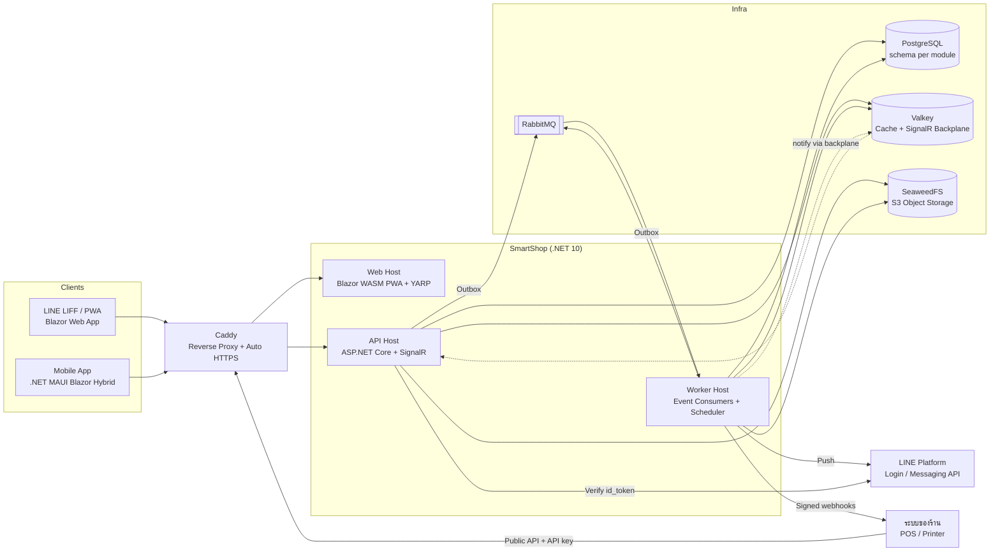
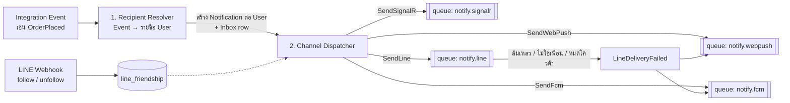

# 03 — Architecture

## 1. Architecture Decision: Event-Driven Modular Monolith

**ข้อเสนอ:** เริ่มด้วย **Modular Monolith + Event-Driven (Outbox + Message Broker)** แยก **API** กับ **Worker** เป็นคนละ Container แล้วค่อยแตกเป็น Microservices เมื่อจำเป็นจริง

**เหตุผล**
- Scale ของหมู่บ้าน (หลักร้อย–หลักพันคนต่อ Plant) ไม่ต้องใช้ Microservices และ VPS เครื่องเดียวก็พอ
- Open Source ที่ Self-host ง่าย = ได้ Contributor และคนเอาไปใช้มากขึ้น (`docker compose up` จบ)
- ยังเป็น **Event-Driven จริง**: ทุก Module สื่อสารผ่าน Integration Event บน RabbitMQ มี Transactional Outbox รับประกันว่า Event ไม่หาย
- **แต่ละ Module มี DB Schema ของตัวเอง** และห้าม Query ข้าม Schema (บังคับด้วย Architecture Test) ทำให้แยกออกเป็น Service ได้โดยแก้น้อยที่สุด



### Modules (Bounded Contexts)

| Module | หน้าที่ | Schema |
|---|---|---|
| **Identity** | User, LINE Account Link, Refresh Token, Consent (PDPA) | `identity` |
| **Plants** | Plant, Membership, Role, Invite, Announcement | `plants` |
| **Shops** | Shop Application, Shop Profile, Opening Hours, Status Override, Delivery Options, Payment Methods, Shop Members | `shops` |
| **Catalog** | Category, Item, Options, Availability, **Inventory** (Stock, Reservation, Ledger) | `catalog` |
| **Ordering** | Cart, Order, Order State Machine, Order Timeline | `ordering` |
| **Payments** | Payment, Slip Attachment, Verification, PromptPay QR Generation | `payments` |
| **Reviews** | Rating, Review, Reply, Moderation | `reviews` |
| **Promotions** | Coupon / Automatic promotion, Redemption (จองสิทธิ์ใน Transaction ของ Checkout) | `promotions` |
| **Audit** | บันทึกการกระทำของ Admin/ร้าน สร้างจาก Integration Event | `audit` |
| **Integrations** | API Keys, Public API v1, Webhook Endpoints + Deliveries | `integrations` |
| **Notifications** | Inbox, Preferences, Recipient Fan-out, Device Registry, LINE Friendship (Webhook), Channel Dispatch + Fallback, Quota Guard | `notifications` |
| **Media** | Upload, Resize/Thumbnail, Presigned URL, Access Control | `media` |
| **Search** | Read Model สำหรับหน้า Home/ค้นหา (Denormalized จาก Event) | `search` |

## 2. Tech Stack (Open Source ทั้งหมด)

| Layer | เลือกใช้ | License | หมายเหตุ |
|---|---|---|---|
| Runtime | **.NET 10** (LTS) | MIT | Support ถึง Nov 2028 |
| API | ASP.NET Core Minimal APIs | MIT | OpenAPI built-in + **Scalar** UI (MIT), Public API อยู่ใต้ `/api/public/v1` |
| Real-time | ASP.NET Core **SignalR** | MIT | Backplane ผ่าน Valkey |
| ORM | **EF Core** + Npgsql | MIT / PostgreSQL | Optimistic Concurrency ด้วย `xmin` |
| Messaging / Mediator / Outbox / Scheduler | **[Wolverine](https://wolverinefx.net)** | MIT | ตัวเดียวครบ: In-process Handler, RabbitMQ Transport, EF Core Transactional Outbox/Inbox, Scheduled Messages, Retry/DLQ |
| Validation | Guard clauses ใน Domain (`SharedKernel.Guard`) | – | ไม่ใช้ Library: กฎอยู่กับ Entity และ Error มี `code` ให้ UI แปลภาษา |
| Mapping | เขียนเอง (`ToDto`) | – | DTO น้อยและตรงไปตรงมา |
| Cache | **HybridCache** (L1 Memory + L2 Valkey) | MIT | Stampede Protection + Tag Invalidation |
| Auth | ASP.NET Core JWT Bearer + LINE OIDC | MIT | ระบบออก JWT เอง |
| Image Processing | **SkiaSharp** | MIT | ย่อรูปเป็น WebP + ลบ EXIF, อ่าน QR บนสลิปด้วย **ZXing.Net** (Apache 2.0) |
| QR | QRCoder + PromptPay EMVCo Payload (เขียนเอง ~100 บรรทัด) | MIT | |
| Logging | `Microsoft.Extensions.Logging` → OpenTelemetry | MIT | |
| Observability | **OpenTelemetry** → Aspire Dashboard (dev) / Grafana + Prometheus + Loki + Tempo (prod, optional) | MIT / Apache / AGPL | AGPL เฉพาะตัว Loki/Tempo ที่รันแยก Container ไม่กระทบ License ของโปรเจกต์ |
| Web Frontend | **Blazor WebAssembly** (Standalone) + PWA | MIT | Host ด้วย ASP.NET Core ที่ Proxy `/api` และ `/hubs` ด้วย **YARP** (Same-origin, ไม่ต้องตั้ง CORS) และส่ง `/app-config.json` ให้ Client |
| Mobile | **.NET MAUI Blazor Hybrid** | MIT | ใช้ Razor Class Library เดียวกับ Web |
| UI Kit | MudBlazor | MIT | |
| Database | **PostgreSQL 17+** | PostgreSQL | `pg_trgm` สำหรับค้นหาภาษาไทย |
| Cache Server | **Valkey 8+** | BSD-3 | Fork ของ Redis ภายใต้ Linux Foundation, ใช้ Client `StackExchange.Redis` ได้เลย |
| Broker | **RabbitMQ 4** | MPL 2.0 | |
| Object Storage | **SeaweedFS** (S3 API) | Apache 2.0 | เขียนผ่าน `AWSSDK.S3` เปลี่ยนเป็น S3/R2/Garage ได้ด้วย Config |
| Reverse Proxy | **Caddy 2** | Apache 2.0 | Auto HTTPS (Let's Encrypt) |
| Dev Orchestration | **.NET Aspire** | MIT | `dotnet run` รันทุกอย่างพร้อม Dashboard |
| Testing | xUnit v3 (Microsoft.Testing.Platform), **Testcontainers**, Shouldly, NetArchTest | Apache / MIT | E2E (Playwright) ยังไม่ได้ทำ |
| CI/CD | GitHub Actions → GHCR, Dependabot/Renovate | – | Multi-arch image (amd64/arm64) |

### License Policy

> ⚠️ ในช่วง 2025 หลาย Library ยอดนิยมใน .NET เปลี่ยนเป็น Commercial License ควรหลีกเลี่ยงเพื่อให้เป็น Open Source ได้จริงและคนอื่นนำไปใช้ต่อได้โดยไม่ติดปัญหา

| ❌ หลีกเลี่ยง | เหตุผล | ✅ ใช้แทน |
|---|---|---|
| MassTransit v9+ | Commercial License | Wolverine |
| MediatR v13+ | Commercial License | Wolverine (In-process handler) |
| AutoMapper v15+ | Commercial License | Mapping เขียนเอง (หรือ Mapperly) |
| FluentAssertions v8+ | Commercial License | Shouldly |
| Duende IdentityServer | Commercial License | JWT เอง (หรือ OpenIddict ถ้าต้องการ OIDC Server เต็มรูปแบบ) |
| ImageSharp | Six Labors Split License | SkiaSharp |
| MinIO | Community Edition ถูกลดฟีเจอร์และหยุดแจกจ่าย Binary | SeaweedFS / Garage |
| Redis | เปลี่ยน License หลายรอบ (SSPL → AGPL) | Valkey (BSD) |

**License ของโปรเจกต์: MIT**

- Library ที่ Link เข้ากับโค้ด (NuGet) ต้องเป็น Permissive License เท่านั้น: MIT / Apache-2.0 / BSD / MPL-2.0 (MPL ใช้แบบไม่แก้ไข Source ได้)
- Software ที่เป็น **AGPL / GPL ใช้ได้เฉพาะแบบรันแยก Process/Container** ที่คุยกันผ่าน Network (เช่น Grafana Loki, Garage) ซึ่งไม่ทำให้โค้ดของ SmartShop ต้องเป็น AGPL
- CI ตรวจ License ของ Dependency อัตโนมัติ (เช่น `dotnet-project-licenses` / GitHub Dependency Review) และ Fail ถ้าพบ GPL/AGPL/Commercial ใน NuGet

## 3. Solution Structure

```
SmartShop/
├─ src/
│  ├─ Aspire/
│  │  ├─ SmartShop.AppHost/          # .NET Aspire orchestration (dev)
│  │  └─ SmartShop.ServiceDefaults/  # OpenTelemetry, Health checks, Resilience
│  ├─ BuildingBlocks/
│  │  ├─ SmartShop.SharedKernel/     # Exceptions (code + message), Ids (UUIDv7), Guard, Shop schedule evaluator
│  │  ├─ SmartShop.Contracts/        # Integration Events + Interface สำหรับเรียกข้าม Module
│  │  └─ SmartShop.Infrastructure/   # ModuleDbContext, Wolverine setup, Auth, Tenancy, Cache, Storage, Realtime, RLS
│  ├─ Modules/                       # 1 Project = 1 Module = 1 Schema
│  │  ├─ SmartShop.Modules.Identity/   Plants/  Shops/  Catalog/  Ordering/  Payments/
│  │  ├─ SmartShop.Modules.Notifications/  Media/  Search/
│  │  └─ SmartShop.Modules.Reviews/  Promotions/  Audit/  Integrations/
│  ├─ Hosts/
│  │  ├─ SmartShop.Bootstrap/        # รวม Module (ModuleCatalog), Middleware, migrate / vapid commands
│  │  ├─ SmartShop.Api/              # Endpoints ทุก Module + SignalR Hub (Messaging role: Api)
│  │  └─ SmartShop.Worker/           # Consumers + Scheduled messages + Recurring jobs
│  └─ Clients/
│     ├─ SmartShop.UI/               # Razor Class Library (Pages, Components, Api client) ใช้ร่วม Web + Mobile
│     ├─ SmartShop.Web.Client/       # Blazor WebAssembly (PWA, LIFF, Web Push)
│     ├─ SmartShop.Web/              # Host ของ PWA + YARP proxy
│     └─ SmartShop.Mobile/           # .NET MAUI Blazor Hybrid (แยก SmartShop.Mobile.slnx)
├─ tests/
│  ├─ SmartShop.UnitTests/
│  ├─ SmartShop.ArchitectureTests/   # กฎ Module boundary + ชื่อ Handler
│  └─ SmartShop.IntegrationTests/    # WebApplicationFactory + Testcontainers (เปิด RLS ทั้งชุด)
├─ deploy/
│  ├─ docker-compose.yml  docker-compose.dev.yml  docker-compose.observability.yml
│  ├─ Caddyfile  .env.example
│  └─ helm/smartshop/
├─ scripts/                          # add-migration, check-licenses, check-razor-params, dev-api
├─ docs/
├─ Directory.Packages.props          # Central Package Management
└─ SmartShop.slnx
```

**กฎ Module Boundary (ตรวจด้วย ArchitectureTests)**
1. Module อ้างอิงกันได้เฉพาะ `*.Contracts` ห้ามอ้าง `Domain`/`Infrastructure` ของ Module อื่น
2. แต่ละ Module มี `DbContext` ของตัวเอง ชี้ไปที่ Schema ของตัวเองเท่านั้น
3. การสื่อสารข้าม Module: **Async** ผ่าน Integration Event (ค่าเริ่มต้น) หรือ **Sync** ผ่าน Interface ใน Contracts (เฉพาะกรณีที่ต้องการคำตอบทันที เช่น Reserve Stock)

ภายใน Module แบ่งเป็น `Domain` (Entity + กฎ), `Data` (DbContext + Migrations), `Endpoints`, `Handlers` (Wolverine), `Services` ส่วน Module เล็กอยู่ในไฟล์เดียว

## 4. Event-Driven Design

### Domain Event vs Integration Event
- **Domain Event**: เกิดใน Aggregate, จัดการใน Transaction เดียวกัน ภายใน Module
- **Integration Event**: ประกาศให้ Module อื่นรู้ (อยู่ใน `SmartShop.Contracts`) ส่งผ่าน **Outbox → RabbitMQ**

### Transactional Outbox (ด้วย Wolverine + EF Core)
```mermaid
sequenceDiagram
    participant H as Command Handler
    participant DB as PostgreSQL
    participant R as Wolverine Relay
    participant MQ as RabbitMQ
    participant C as Consumer (Worker)
    H->>DB: BEGIN; save Order + insert outbox row; COMMIT
    R->>DB: poll outbox
    R->>MQ: publish OrderPlaced
    R->>DB: mark sent
    MQ->>C: deliver (at-least-once)
    C->>DB: Inbox check (dedupe by MessageId) → handle
```
- รับประกัน: ถ้า Order ถูกบันทึก Event ต้องถูกส่งแน่นอน (ไม่มี Dual-write problem)
- Consumer ต้อง **Idempotent** (Inbox + Message ID)
- Retry แบบ Exponential Backoff → Dead Letter Queue + Alert

### Scheduled Messages (แทน Cron)
Wolverine ส่งข้อความล่วงหน้าได้ (Durable เก็บใน Postgres)

| Job | Trigger |
|---|---|
| `ExpireOrderIfNotAccepted` | ตั้งเวลาตอน `OrderPlaced` + Timeout ของร้าน |
| `AutoCompleteOrder` | ตั้งเวลาตอน `OrderDelivered` + X ชั่วโมง |
| `EvaluateShopStatus` | ตั้งเวลาตาม Boundary ถัดไปของตารางเวลาร้าน (เปิด/ปิด/สิ้นสุด Override) → Publish `ShopStatusChanged` |
| `ResetDailyStock` | ทุกวันตามเวลาที่ร้านตั้ง |
| `ReleaseExpiredCart` | Cart ไม่มีความเคลื่อนไหว 24 ชม. |
| `RemindShopPendingOrder` | ตั้งเวลาตอน `OrderPlaced` + 3 นาที (ตั้งค่าได้) ถ้ายังไม่มีใครรับ → เตือนสมาชิกร้านซ้ำ |

> การคำนวณ "ร้านเปิดอยู่ไหม" ทำได้แบบ On-read เสมอ (ไม่ต้องพึ่ง Job) แต่ Job ใช้สำหรับ **Push Event** ให้หน้าจอ Real-time, Cache Invalidation และแจ้งเตือน "ร้านโปรดเปิดแล้ว"

ดูรายการ Event ทั้งหมดที่ [Domain Model § Event Catalog](04-domain-model.md#event-catalog)

### Notification Pipeline

แยกเป็น 2 ขั้น เพื่อให้ Retry ต่อช่องทางได้อิสระ และช่องทางหนึ่งล่มไม่กระทบอีกช่องทาง



- **Recipient Resolver** อ่าน Shop Members ที่เปิดรับแจ้งเตือน (Cache `shop:{id}:notify-recipients`)
- **Dispatcher** ตัดสินช่องทางจาก Preference ของ User, สถานะเพื่อน LINE, อุปกรณ์ที่ลงทะเบียน และ Priority กับโควต้า LINE
- **Idempotent** ด้วย Unique Key `(event_id, user_id, channel)` ใน `notification_delivery` ทำให้ Retry ไม่ส่งซ้ำ
- Web Push Subscription ที่ได้ `404/410` และ FCM Token ที่ไม่ถูกต้อง → ลบออกอัตโนมัติ
- **Reminder** ของ Order ใหม่ใช้ Scheduled Message `RemindShopPendingOrder` (ยกเลิกเองเมื่อ Order ไม่อยู่สถานะ `PendingAcceptance` แล้ว)
- ข้อมูล: `notification` (Inbox), `notification_delivery` (ผลการส่งต่อช่องทาง), `user_device` (Web Push / FCM ต่ออุปกรณ์), `line_friendship`, `notification_preference`, `line_quota_usage`

## 5. Caching Strategy

ใช้ **HybridCache** (L1 In-memory ต่อ Instance + L2 Valkey ที่ใช้ร่วมกัน) พร้อม **Event-driven Invalidation**: Consumer ฟัง Integration Event แล้ว `RemoveByTagAsync`

| ข้อมูล | Key / Tag | TTL | Invalidate เมื่อ |
|---|---|---|---|
| หน้า Home ของ Plant (รายการร้าน + สถานะ) | `plant:{id}:shops` / tag `plant:{id}` | 5 นาที | `ShopProfileUpdated`, `ShopStatusChanged`, `ShopApproved`, `ShopSuspended` |
| เมนูร้าน (Catalog) | `shop:{id}:menu` / tag `shop:{id}` | 10 นาที | `Item*`, `ItemSoldOut`, `ItemBackInStock` |
| ข้อมูลร้าน + เวลาเปิดปิด | `shop:{id}:profile` | 30 นาที | `ShopProfileUpdated`, `OpeningHoursChanged` |
| สิทธิ์ผู้ใช้ใน Plant + Shop Roles | `user:{id}:memberships` | 10 นาที | `Membership*`, `ShopMember*` |
| ผู้รับแจ้งเตือนของร้าน | `shop:{id}:notify-recipients` | 10 นาที | `ShopMember*`, `ShopMemberNotificationToggled` |
| ช่องทางของ User (LINE friend, devices) | `user:{id}:channels` | 10 นาที | `LineFriendshipChanged`, `DeviceRegistered/Removed` |
| Payment Methods ของร้าน | `shop:{id}:payments` | 30 นาที | `PaymentMethodsUpdated` |
| LINE Public Key / JWKS | `line:jwks` | 24 ชม. | – |

**สิ่งที่ห้าม Cache เป็น Source of Truth**
- **จำนวน Stock ตอน Checkout** ตรวจกับ DB เสมอ (Atomic Update) Cache ใช้แค่แสดงผล "เหลือน้อย/หมด"
- **สถานะ Order / Payment** อ่านจาก DB + Push ผ่าน SignalR

**อื่น ๆ**
- **ไม่มี Public Endpoint ของข้อมูลร้าน** ทุก Endpoint ต้องมี JWT + Active Membership (ยกเว้น Auth, LINE Webhook, Health, หน้า Landing แบบ Generic)
- **Image Caching:** รูปสินค้า/ร้านให้บริการผ่าน API ด้วย **Signed URL (HMAC) อายุ 1–2 ชม.** (ปัดเป็นชั่วโมงเพื่อให้ URL เดิมใช้ Cache ซ้ำได้) (ออกให้หลังตรวจ Membership) + `Cache-Control: private, max-age=3600` เพื่อให้ Browser Cache ได้ แต่ห้าม Shared/CDN Cache เพราะคนนอกหมู่บ้านต้องเข้าไม่ได้
- **Idempotency-Key** ของ Checkout เก็บกับ Order (Unique ต่อผู้ใช้) ส่งซ้ำได้ Order เดิมกลับไป
- **Rate Limiting** ด้วย ASP.NET Core Rate Limiter (ต่อ User / ต่อ IP, Login ต่อ IP, Public API ต่อ API key)
- **SignalR Backplane** บน Valkey เพื่อ Scale API ได้หลาย Instance

## 6. Security & Multi-tenancy

- **Tenant Resolution:** Client ส่ง Header `X-Plant-Id` → Middleware ตรวจว่า User เป็นสมาชิก **Active** (จาก Cache) → ใส่ใน `ICurrentPlant` สมาชิก `Pending` / `Suspended` ได้ `403` ทุก Endpoint ของ Plant ยกเว้นดูสถานะคำขอของตัวเอง
- **ไม่มี Public Shop Page:** คนนอกหมู่บ้านไม่เห็นข้อมูลใด ๆ, Link Preview เป็นแบบ Generic, รูปสินค้าและร้านให้บริการผ่าน **Presigned URL / Signed Path ที่ตรวจ Membership** (ไม่เปิด Bucket เป็น Public)
- **กรองตาม Plant ทุก Query** (`plant_id = ICurrentPlant.PlantId`) และเปิด **PostgreSQL Row-Level Security** เพิ่มได้ (`Database:RowLevelSecurity=true`): Migrator สร้าง Policy `tenant_isolation` ให้ทุกตารางที่มี `plant_id` ระหว่าง Request ที่อยู่ในหมู่บ้าน Connection จะ `SET ROLE smartshop_app` และตั้ง `smartshop.plant_id` ทำให้ Query ที่ลืมกรองก็อ่านข้ามหมู่บ้านไม่ได้ (Integration test ทั้งชุดรันโดยเปิด RLS)
- **Authorization:** Policy-based (`PlantAdmin`, `PlantMember`) + Resource-based (`ShopRole >= Staff | Manager | Owner` ตรวจกับ Shop ที่ถูกเรียก)
- **LINE Webhook:** ตรวจ `X-Line-Signature` (HMAC-SHA256 ด้วย Channel Secret) ทุก Request
- **Public API:** API key ต่อร้าน (เก็บแค่ SHA-256), Scope, Revoke, Rate limit ต่อ Key
- **Outgoing Webhooks:** ลงลายเซ็น HMAC-SHA256, กัน **SSRF** (https เท่านั้น, ปฏิเสธ IP ภายใน/Link-local/Metadata ทั้งตอนบันทึกและตอนเชื่อมต่อ, ไม่ตาม Redirect) ดู [06-public-api.md](06-public-api.md)
- **ไฟล์สลิป/รูปส่งของ:** Private Bucket เข้าถึงผ่าน **Presigned URL อายุสั้น** หลังตรวจสิทธิ์ (ผู้ซื้อ / ร้าน / Plant Admin)
- **Upload:** ตรวจ Magic Bytes, จำกัดขนาด, ลบ EXIF (ตำแหน่ง GPS) ก่อนเก็บ
- **Secrets:** ผ่าน Environment Variables / Docker Secrets ห้าม Commit (มี `.env.example`)
- **PDPA:** เก็บ Consent Version, Endpoint Export/ลบข้อมูล, Mask เบอร์โทร

## 7. Deployment

### Production (VPS เครื่องเดียว 2 vCPU / 4 GB RAM รองรับได้หลายหมู่บ้าน)

```yaml
# deploy/docker-compose.yml (ย่อ)
services:
  caddy:     { image: caddy:2.10-alpine, ports: ["80:80", "443:443"] }   # /api /hubs /health → api, ที่เหลือ → web
  web:       { image: ghcr.io/<owner>/smartshop-web:${TAG} }
  api:       { image: ghcr.io/<owner>/smartshop-api:${TAG} }               # Messaging__Role=Api
  worker:    { image: ghcr.io/<owner>/smartshop-worker:${TAG} }
  migrator:  { image: ghcr.io/<owner>/smartshop-api:${TAG}, command: ["migrate"], restart: "no" }
  postgres:  { image: postgres:17 }
  valkey:    { image: valkey/valkey:8 }
  rabbitmq:  { image: rabbitmq:4-management }
  seaweedfs: { image: chrislusf/seaweedfs, command: "server -s3" }
```

- Build Image ด้วย **.NET SDK Container Publish** (`dotnet publish /t:PublishContainer`) ไม่ต้องเขียน Dockerfile ได้ Image แบบ **Chiseled** (เล็ก, Non-root, Attack Surface ต่ำ)
- Health Checks (`/health/live`, `/health/ready`) ใช้ใน `depends_on: condition: service_healthy` (Image แบบ Chiseled ไม่มี curl จึงใช้ `dotnet <app>.dll --healthcheck`)
- Backup: `pg_dump` ตามรอบ + Sync SeaweedFS ไป Off-site Storage
- **Observability:** `docker compose -f docker-compose.yml -f docker-compose.observability.yml up -d` (Grafana + Tempo + Loki + Prometheus ใน otel-lgtm)
- **Kubernetes:** Helm chart `deploy/helm/smartshop` (api + HPA, worker, web, Ingress, Migration Job เป็น pre-install/upgrade hook) ใช้ Postgres/Valkey/RabbitMQ/S3 ภายนอก

### Scale-out Path (เมื่อจำเป็น)
1. เพิ่ม Instance ของ `api` / `worker` (Stateless อยู่แล้ว: Valkey Backplane + Postgres Outbox)
2. แยก Module ที่โหลดสูง (เช่น Notifications, Media) เป็น Service แยก: เปลี่ยนแค่ Host + Connection String เพราะสื่อสารผ่าน RabbitMQ อยู่แล้ว
3. ย้ายไป Kubernetes ด้วย Helm Chart ที่มีให้แล้ว

## 8. CI/CD (GitHub Actions)

```
PR / main:  restore → dotnet format (verify) → build → Razor parameter check → unit + architecture tests
            → integration tests (Testcontainers) | Android build (MAUI) | Helm lint + compose config | license check
main / tag: containers.yml → multi-arch images (SDK container publish, chiseled) → GHCR
```
พร้อม: CodeQL, Dependabot/Renovate, Conventional Commits, `CONTRIBUTING.md`, Issue/PR Templates, `CODE_OF_CONDUCT.md`
