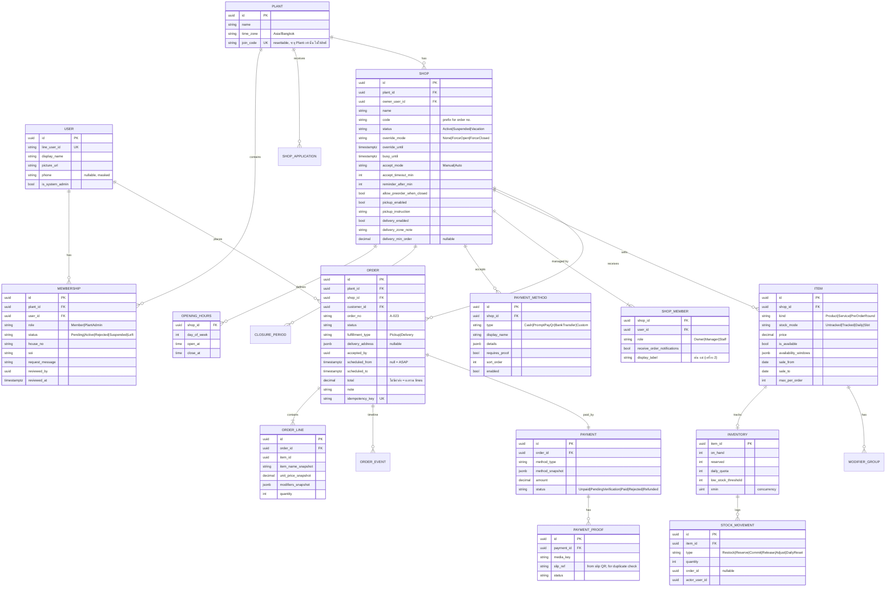
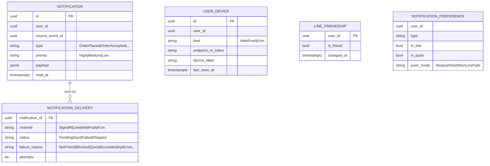
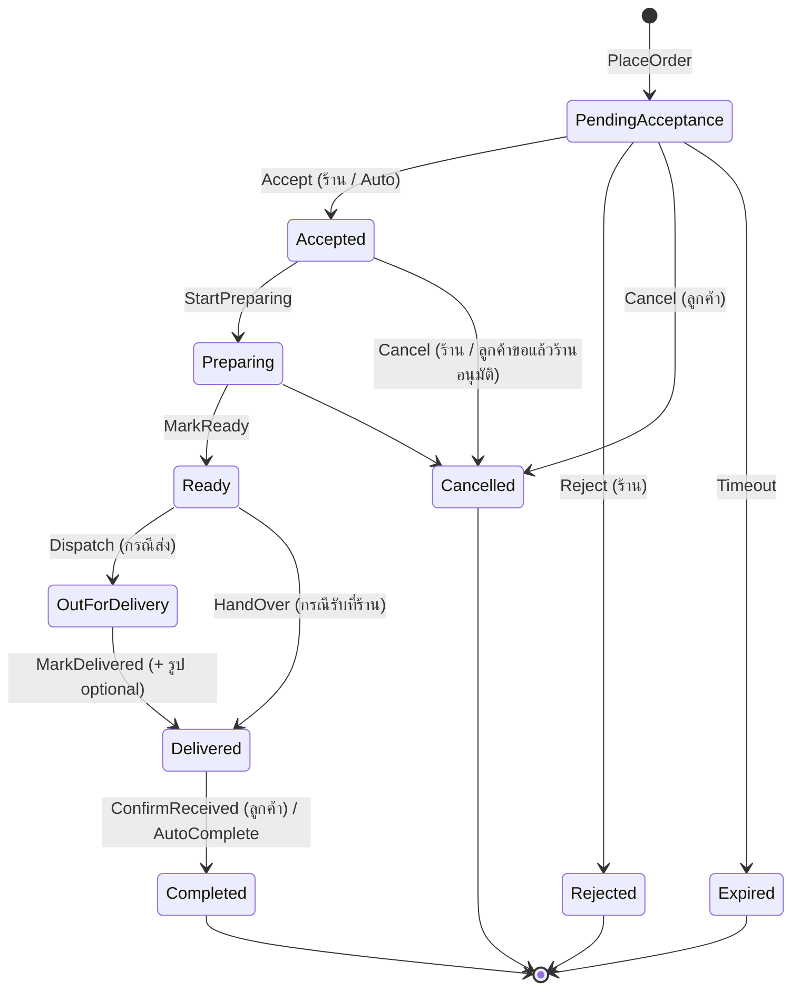

# 04 — Domain Model & Events

## 1. ERD (ภาพรวม แยกตาม Module/Schema)



### Notifications (schema `notifications`)



> FK ข้าม Module (เช่น `ORDER.shop_id`) เป็นแค่ ID ไม่มี Foreign Key Constraint จริงใน DB เพื่อให้แยก Schema/Service ได้

## 2. Order State Machine



- สำหรับ **Service**: `Ready` = "พร้อมให้บริการ", `OutForDelivery` = "กำลังไปให้บริการที่บ้าน", `Delivered` = "ให้บริการแล้ว"
- `Accept` บันทึก `accepted_by` (สมาชิกร้านคนที่กด) ใช้ Optimistic Concurrency กันสมาชิกหลายคนกดพร้อมกัน
- ร้านข้ามขั้นได้ (เช่น Accept แล้วกด `Delivered` ทันทีสำหรับของพร้อมขาย) โดยระบบเติม Event ที่ข้ามให้ใน Timeline
- ทุก Transition บันทึก `ORDER_EVENT` (ใคร, เมื่อไร, เหตุผล, รูป)

## 3. Stock Reservation

**Reserve ต้องเป็น Synchronous** (ลูกค้าต้องรู้ทันทีว่าของพอไหม) จึงเรียกผ่าน Contract `IInventoryService.ReserveAsync()` ใน Transaction เดียวกับการสร้าง Order (Module ต่างกันแต่ DB เดียวกัน) ส่วน Commit/Release เป็น **Asynchronous** ผ่าน Event

```sql
-- Reserve แบบ Atomic: ไม่ต้อง Lock, กัน Overselling ได้แม้มีคนสั่งพร้อมกัน
UPDATE catalog.inventory
SET reserved = reserved + @qty
WHERE item_id = @itemId
  AND on_hand - reserved >= @qty;
-- affected rows = 0  →  ของไม่พอ → ยกเลิก Transaction ทั้งหมด
```

| Event ที่รับ | Action | SQL |
|---|---|---|
| (sync) PlaceOrder | Reserve | `reserved += q WHERE on_hand - reserved >= q` |
| `OrderCompleted` | Commit | `on_hand -= q, reserved -= q` |
| `OrderCancelled` / `OrderRejected` / `OrderExpired` | Release | `reserved -= q` |
| ร้านปรับยอด | Adjust | `on_hand = x` (ห้ามต่ำกว่า `reserved`) |
| `ResetDailyStock` | DailyReset | `on_hand = daily_quota + reserved` |

ทุก Action เขียน `STOCK_MOVEMENT` และถ้า Available เปลี่ยนเป็น 0 / กลับมามากกว่า 0 → Publish `ItemSoldOut` / `ItemBackInStock`

> **Service Slot (P2)** ใช้หลักเดียวกัน โดย Inventory แยกตาม `(item_id, slot_start)` มี `capacity` แทน `on_hand`

## 4. Shop Status Evaluation

```csharp
// ภาพรวม Logic (อยู่ใน Shops.Domain, Pure function ทดสอบง่าย)
ShopStatus Evaluate(Shop shop, DateTimeOffset nowUtc)
{
    var local = TimeZoneInfo.ConvertTime(nowUtc, shop.TimeZone);

    if (shop.Status == Suspended)                  return Closed(Reason.Suspended);
    if (shop.ActiveClosurePeriod(local) is { } c)  return Closed(Reason.TemporaryClosed, until: c.End);
    if (shop.Override is { Until: var u } o && (u is null || u > nowUtc))
        return o.Mode == ForceOpen ? Open(until: u) : Closed(Reason.Manual, until: u);

    var slot = shop.Schedule.CurrentSlot(local);
    if (slot is null) return Closed(Reason.OutsideHours, nextOpen: shop.Schedule.NextOpen(local));

    return shop.BusyUntil > nowUtc ? Busy(until: shop.BusyUntil) : Open(until: slot.CloseAt);
}
```

## 5. Event Catalog

Integration Events ทั้งหมดอยู่ใน `SmartShop.Contracts` ตั้งชื่อเป็น **Past Tense** และมี `EventId`, `OccurredAt`, `PlantId`, `Version` เสมอ

| Event | Publisher | Consumers |
|---|---|---|
| `UserRegistered` | Identity | Notifications (Welcome) |
| `MembershipRequested` | Plants | Notifications → Plant Admins |
| `MembershipApproved` / `MembershipRejected` / `MembershipSuspended` | Plants | Notifications → ผู้ขอ, Cache Invalidation |
| `PlantAdminAssigned` | Plants | Cache Invalidation |
| `ShopApplicationSubmitted` | Shops | Notifications → Plant Admins |
| `ShopApplicationChangesRequested` | Shops | Notifications → ผู้ขอ |
| `ShopApplicationApproved` | Shops | Shops (Create Shop), Notifications, Search |
| `ShopApplicationRejected` | Shops | Notifications |
| `ShopProfileUpdated` | Shops | Search, Cache |
| `OpeningHoursChanged` | Shops | Worker (Reschedule `EvaluateShopStatus`), Cache |
| `ShopStatusChanged` (Open/Closed/Busy) | Shops | Search, Cache, SignalR (Plant feed), Notifications (Favorite → "ร้านเปิดแล้ว") |
| `ShopSuspended` / `ShopReinstated` | Shops | Search, Cache, Notifications |
| `PaymentMethodsUpdated` / `DeliveryOptionsUpdated` | Shops | Cache, Search |
| `ShopMemberAdded` / `ShopMemberRemoved` / `ShopMemberRoleChanged` | Shops | Cache, Notifications → สมาชิกที่ถูกเพิ่ม/ลบ |
| `ShopMemberNotificationToggled` | Shops | Cache (`notify-recipients`) |
| `ShopOwnershipTransferred` | Shops | Cache, Notifications, Audit |
| `AnnouncementPublished` | Plants | Notifications → สมาชิก (ถ้าเลือกแจ้งเตือน), Audit |
| `LineFriendshipChanged` | Notifications (จาก LINE Webhook) | Cache (`user:{id}:channels`) |
| `ItemCreated` / `ItemUpdated` / `ItemDeleted` | Catalog | Search, Cache |
| `ItemSoldOut` / `ItemBackInStock` | Catalog | Search, Cache, SignalR (Shop page) |
| `StockLow` | Catalog | Notifications → ร้าน |
| `OrderPlaced` | Ordering | Payments (Create Payment), Integrations (Webhook), Notifications → **สมาชิกร้านทุกคนที่เปิดรับ**, Worker (Schedule Expire / Reminder / Auto-accept) |
| `OrderAccepted` | Ordering | Notifications → ลูกค้า, SignalR → หยุดเสียงเตือนบนเครื่องสมาชิกร้านคนอื่น |
| `OrderRejected` / `OrderCancelled` / `OrderExpired` | Ordering | Catalog (Release Stock), Promotions (คืนสิทธิ์คูปอง), Payments (Void/Refund flag), Integrations, Notifications |
| `OrderPreparing` / `OrderReady` / `OrderOutForDelivery` | Ordering | Notifications, SignalR |
| `OrderDelivered` | Ordering | Notifications → ลูกค้า, Worker (Schedule AutoComplete) |
| `OrderCompleted` | Ordering | Catalog (**Commit Stock**), Reviews (เปิดให้รีวิว), Analytics |
| `PaymentProofUploaded` | Payments | Notifications → ร้าน (ตรวจสลิปซ้ำทำตอนอัปโหลด) |
| `PaymentVerified` / `PaymentRejected` | Payments | Ordering (อาจปลด Gate "จ่ายก่อนทำ"), Integrations (`payment.verified`), Notifications |
| `ReviewSubmitted` | Reviews | Shops (Update Rating Aggregate → `ShopRatingChanged`), Notifications → ร้าน |
| `ReviewReplied` | Reviews | Notifications → ลูกค้า |
| `ReviewModerated` | Reviews | Shops (คำนวณ Rating ใหม่), Audit |
| `ShopRatingChanged` | Shops | Search |
| `UserErased` | Identity | ทุก Module ที่เก็บข้อมูลส่วนบุคคล (ลบ/ทำให้ไม่ระบุตัวตน) |

**Command แบบ Async / ตั้งเวลา** (`IScheduledCommand` ส่งไป Worker): `EvaluateShopStatus`, `ExpireOrderIfNotAccepted`, `RemindShopPendingOrder`, `AutoCompleteOrder`,
`VerifySlip` (ส่งสลิปไปตรวจกับบริการภายนอก), `DeliverWebhook` (ส่ง/ส่งซ้ำ Webhook แบบ Backoff), `SendTestNotification`

**Audit log** (Module `Audit`) สร้างจาก Event ของการอนุมัติ/ระงับสมาชิก, คำขอเปิดร้าน, ระงับร้าน, โอนร้าน, ประกาศ และการซ่อนรีวิว
จึงไม่มี Module ไหนต้องจำว่าต้องเขียน Audit เอง (Idempotent ด้วย `EventId`)

### ตัวอย่าง Contract

```csharp
namespace SmartShop.Contracts.Ordering;

public sealed record OrderPlaced(
    Guid EventId,
    DateTimeOffset OccurredAt,
    Guid PlantId,
    Guid OrderId,
    string OrderNo,
    Guid ShopId,
    Guid CustomerId,
    decimal Total,
    string FulfillmentType,
    string PaymentMethodType,
    IReadOnlyList<OrderPlacedLine> Lines) : IIntegrationEvent;

public sealed record OrderPlacedLine(Guid ItemId, int Quantity);
```

### ตัวอย่าง Handler (Wolverine)

```csharp
// Catalog module: ฟัง OrderCompleted แล้วตัด Stock จริง
public static class OrderCompletedHandler
{
    public static async Task Handle(OrderCompleted e, CatalogDbContext db, HybridCache cache, CancellationToken ct)
    {
        foreach (var line in e.Lines)
            await db.Inventory.CommitAsync(line.ItemId, line.Quantity, e.OrderId, ct);

        await db.SaveChangesAsync(ct);                       // + Outbox (ItemSoldOut ถ้าหมด)
        await cache.RemoveByTagAsync($"shop:{e.ShopId}", ct);
    }
}
```
